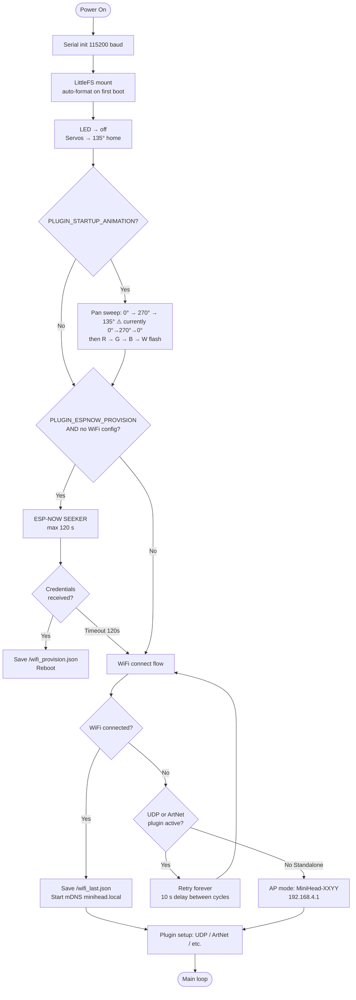
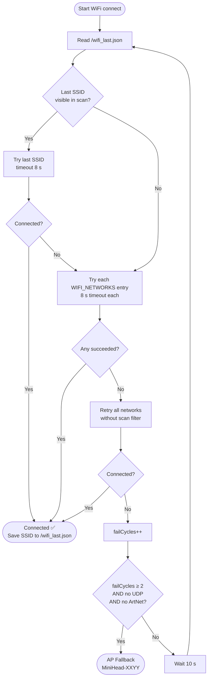
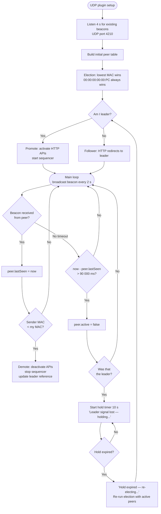
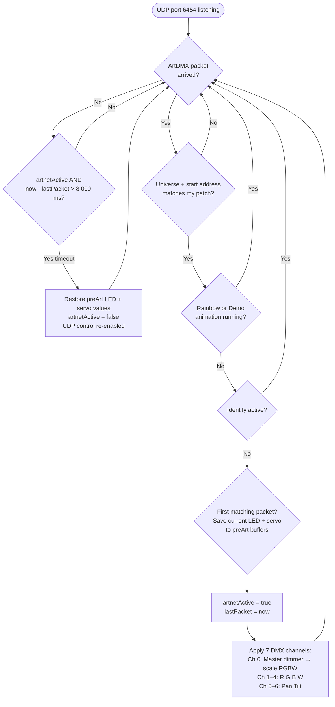
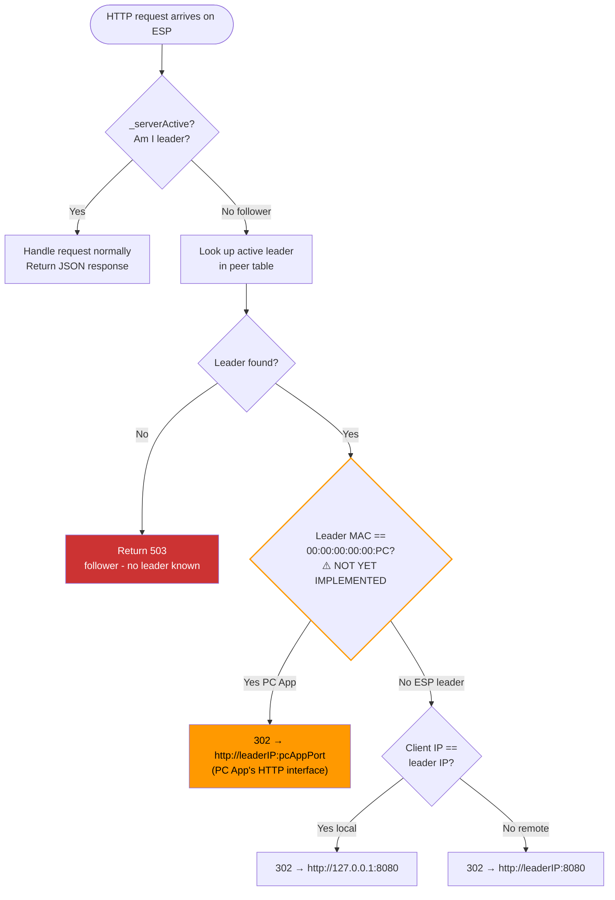
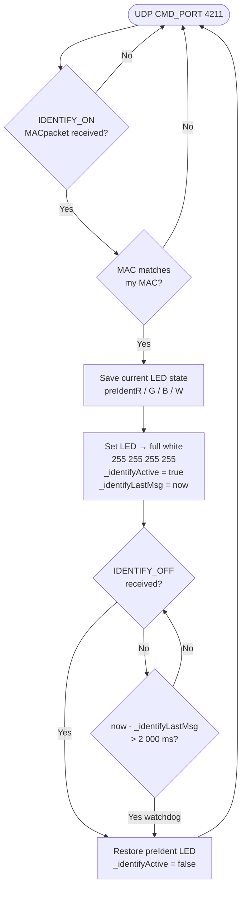
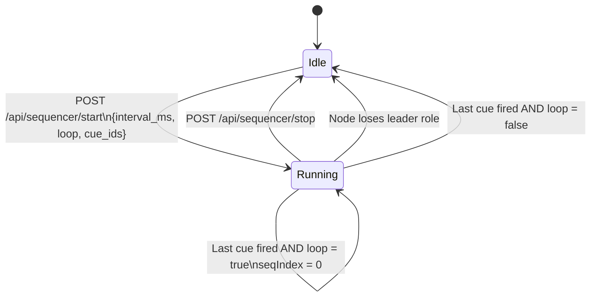
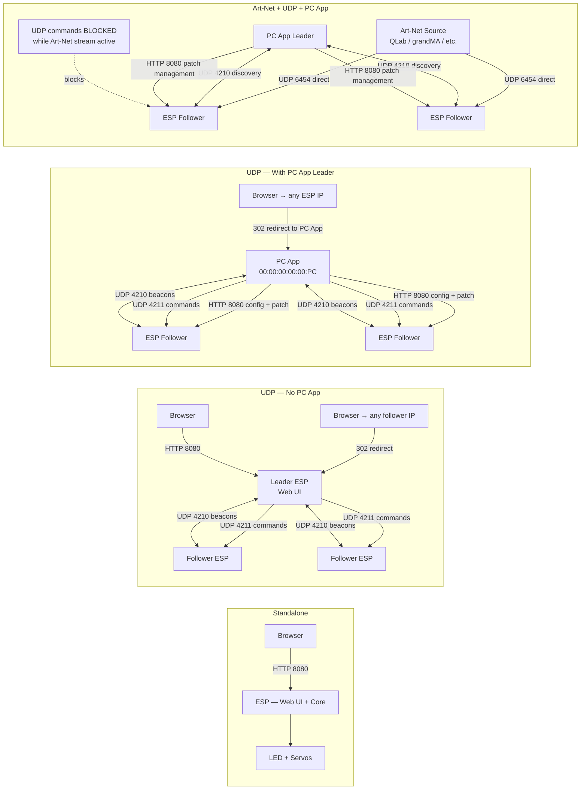

# MiniHead Firmware — Feature Map & Expected vs Reality

> **How to read this document**
> Each feature section shows what Simon expects the feature to do, what the code actually does, and whether they match. Flowcharts use Mermaid syntax and render in GitHub, VS Code, and Obsidian.
>
> **Status legend:** ✅ Matches · ⚠️ Partial · ❌ Gap · 🐛 Known bug · 🔲 Undefined

---

## Table of Contents

1. [Architecture & Plugin Stack](#1-architecture--plugin-stack)
2. [Feature × Mode Matrix](#2-feature--mode-matrix)
3. [Communication Map by Mode](#3-communication-map-by-mode)
4. [Timeout & Interval Reference](#4-timeout--interval-reference)
5. [Feature-by-Feature Analysis](#5-feature-by-feature-analysis)
6. [Flowcharts](#6-flowcharts)
7. [Known Broken](#7-known-broken)
8. [Gap Summary](#8-gap-summary)

---

## 1. Architecture & Plugin Stack

```
[ Standalone Core ]        ← always on — base layer
                             Web UI, cues, sequencer, animations
   + UDP Control           ← peer discovery, leader election, PC App integration
   + Art-Net               ← DMX512 control, stacks on top of UDP

[ Optional: ESP-NOW ]      ← independent feature (like Profiler/Startup Anim)
[ Optional: Startup Anim ] ← boot servo sweep + color test
[ Optional: Profiler ]     ← debug serial output
```

### Mode Behavior

- **Standalone** is always the base. Every head has a Web UI, cues, sequencer, and animations regardless of other plugins.
- **UDP Control stacks on top**: adds peer discovery, leader election, and PC App integration. One leader hosts the Web UI for the whole rig.
- **Art-Net stacks on top of UDP**: DMX stream controls color + position. When an Art-Net stream is active, UDP command control is blocked. Discovery keeps running.
- **PC App always wins leadership**: PC App uses fake MAC `00:00:00:00:00:PC` (numerically lowest MAC possible), so it always wins the leader election. When PC App joins, the current ESP leader demotes itself to follower.
- **Art-Net mode has no ESP Web UI**: In Art-Net setups the PC App is the only control interface. ESPs should redirect any browser requests to the PC App. *(Currently not implemented — see Gap #2, #3.)*

---

## 2. Feature × Mode Matrix

| Feature | Standalone | UDP (no PC App) | UDP + PC App | Art-Net + PC App |
|---|:---:|:---:|:---:|:---:|
| RGBW + Pan/Tilt control | ✅ Web UI | ✅ leader Web UI | ✅ PC App UI | ✅ via DMX |
| Cue save / fire | ✅ | ✅ | ✅ PC App | ⬜ N/A |
| Cue sequencer | ✅ | ✅ | ✅ | ⬜ N/A |
| Rainbow / Demo animations | ✅ | ✅ | ✅ | ❌ blocked by Art-Net |
| Serial debug | ✅ | ✅ | ✅ | ✅ |
| Multi-head control | ❌ | ✅ | ✅ | ✅ via DMX |
| Identify head | ❌ | ✅ | ✅ | ✅ |
| Art-Net patch management | ❌ | ❌ | ✅ PC App | ✅ PC App |
| ESP Web UI accessible | ✅ | ✅ on leader | ❌ 302 → PC App | ❌ 302 → PC App |
| ESP-NOW provisioning | ✅ if enabled | ✅ if enabled | ✅ if enabled | ✅ if enabled |

---

## 3. Communication Map by Mode

| Mode | ESP ↔ ESP | PC App ↔ ESP | Art-Net source | Web UI hosted on |
|---|---|---|---|---|
| Standalone | None | None | — | Each ESP |
| UDP (no PC App) | Beacons UDP 4210, commands UDP 4211, HTTP 8080 | — | — | Leader ESP |
| UDP + PC App | Beacons UDP 4210 | Beacons 4210, commands 4211, HTTP 8080 | — | PC App |
| Art-Net + PC App | Beacons UDP 4210 (discovery only) | HTTP 8080 for patch | UDP 6454 direct to each ESP | PC App only |

---

## 4. Timeout & Interval Reference

| Feature | Value | Constant | File |
|---|---|---|---|
| WiFi connect timeout per SSID | 8 000 ms | — | `main.ino:27` |
| WiFi retry delay between cycles | 10 000 ms | — | `main.ino:189` |
| AP fallback trigger | 2 fail cycles | — | `main.ino:174` |
| Discovery beacon broadcast | 2 000 ms | `BEACON_INTERVAL_MS` | `discovery_globals.h:12` |
| Peer / leader stale timeout | 90 000 ms | `LEADER_TIMEOUT_MS` | `discovery_globals.h:13` |
| Hold after leader lost | 10 000 ms | `HOLD_DURATION_MS` | `discovery_globals.h:14` |
| Initial discovery listen window | 4 000 ms | — | `discovery.h:192` |
| ESP-NOW SEEKER beacon interval | 2 000 ms | `PROVISION_BEACON_MS` | `espnow_provision_config.h:13` |
| ESP-NOW total provisioning window | 120 000 ms | `PROVISION_TIMEOUT_MS` | `espnow_provision_config.h:14` |
| ESP-NOW per-channel wait | 300 ms | — | `espnow_provision.h:328` |
| Art-Net idle timeout | 8 000 ms | `ARTNET_TIMEOUT_MS` | `artnet_globals.h:14` |
| Identify flash timeout | 2 000 ms | `IDENTIFY_TIMEOUT_MS` | `udp_commands.h:18` |
| Servo update interval | 20 ms | — | `core.h:185` |
| Servo smooth factor | 0.12 | `SERVO_SMOOTH` | `core.h:60` |
| Servo deadband | 1.5° | `SERVO_DEADBAND` | `core.h:61` |
| Sequencer default cue interval | 1 000 ms | `seqInterval` | `wifi_control.h:89` |
| Profiler serial report | 5 000 ms | — | `profiler.h:19` |

---

## 5. Feature-by-Feature Analysis

### 5.1 LED / Color Control

| | |
|---|---|
| **Expected** | Instant color snap. W (white) is a fully independent channel — not additive on top of RGB. All 4 channels (R G B W) set separately. |
| **Reality** | `setLED(r,g,b,w)` in `core.h` — sets all 4 channels instantly to exact values. Skips hardware write if values unchanged (saves CPU). |
| **Status** | ✅ Matches |

---

### 5.2 Servo / Motion

| | |
|---|---|
| **Expected** | Servos ease smoothly to new target. No snapping. Absorbs network jitter naturally. |
| **Reality** | Exponential smoothing at 50 Hz (`SERVO_SMOOTH = 0.12f`). 1.5° deadband prevents micro-hunting. Runs every 20 ms regardless of command rate. Servos hold last position indefinitely when no new command arrives. |
| **Status** | ✅ Matches |

---

### 5.3 Boot / Startup Sequence

| | |
|---|---|
| **Expected** | Pan sweeps **0° → 270° → 135°** (home/center position). After servo settles at 135°: color test flash R → G → B → W. |
| **Reality** | `PLUGIN_STARTUP_ANIMATION` performs sweep **0° → 270° → 0°** (returns to zero, not center). Color test follows. |
| **Status** | ⚠️ Partial — sweep endpoint is wrong. Code returns to 0°; expected is 135° (center). |
| **Gap #1** | Change final sweep position from `0` to `135` in `plugins/startup_animation/`. |

---

### 5.4 Serial Control

| | |
|---|---|
| **Expected** | Developer / debug only. Operators never use it. |
| **Reality** | USB-C at 115200 baud. Parses the same command format as UDP (`R:255,G:0,B:0,PAN:90,...`). Available in all modes. |
| **Status** | ✅ Matches |

---

### 5.5 WiFi / AP Fallback / mDNS

| | |
|---|---|
| **Expected** | Try known networks → fall back to AP (open or with password). Device discoverable via `minihead.local`. |
| **Reality** | Tries last-connected SSID first, then `WIFI_NETWORKS[]` list, then retries without scan filter. After 2 failed cycles (Standalone only) → creates `MiniHead-XXYY` AP. mDNS on `minihead.local`. AP password via `AP_PASSWORD` in config or `/config.json`. UDP/Art-Net devices **retry forever** and never create an AP. |
| **Status** | ✅ Matches |

---

### 5.6 Standalone Mode — Full Feature Set

| | |
|---|---|
| **Expected** | Web UI (RGBW + Pan/Tilt sliders), cue save/fire, sequencer, serial debug, Rainbow/Demo animations — all work without any peer or PC App on the network. |
| **Reality** | All features present in core + wifi plugin. No peer or PC App required. |
| **Status** | ✅ Matches |

---

### 5.7 UDP Leader Election

| | |
|---|---|
| **Expected** | Lowest MAC address wins. PC App fake MAC `00:00:00:00:00:PC` is always lowest → PC App always wins. When PC App is absent, the ESP with the lowest MAC is leader. |
| **Reality** | Lowest-MAC election on startup after 4 s listen window. If a beacon with a lower MAC arrives later, current leader demotes itself. After leader goes silent for 90 s: 10 s hold period → re-election with remaining active peers. |
| **Status** | ✅ Design correct |
| **🐛 Known bug** | Leader election is flaky in practice. Wrong device sometimes wins; leadership doesn't always transfer correctly. |

---

### 5.8 Multi-Head — UDP Mode

| | |
|---|---|
| **Expected** | ESPs talk peer-to-peer via UDP beacons. Opening any ESP's IP in a browser should redirect to the leader. Leader Web UI shows all peers and can command individual heads or all at once. PC App becomes leader when it joins. |
| **Reality** | UDP beacons on port 4210 (broadcast every 2 s). Commands on port 4211 (`CMD|MAC|command`). Follower ESPs redirect HTTP to leader. Leader serves full peer table via `/api/heads`. |
| **Status** | ✅ Matches |

---

### 5.9 Web UI When PC App Is Leader

| | |
|---|---|
| **Expected** | When PC App is leader (MAC `00:00:00:00:00:PC`), opening any ESP's IP in a browser should return a **302 redirect to the PC App's URL** — not to another ESP. ESP Web UI is fully disabled while PC App leads. |
| **Reality** | Follower ESPs redirect to the **ESP leader's IP** — no check whether the leader is a PC App or another ESP. If PC App is leader, the redirect points to the PC App's IP, but to port 8080 (which assumes the PC App listens there — unverified). MAC `00:00:00:00:00:PC` is not detected to trigger any different redirect logic. |
| **Status** | ❌ Gap — redirect logic doesn't distinguish PC App from ESP leader. |
| **Gap #2** | In `wifi_control.h` redirect handler: if `leaderMAC == "00:00:00:00:00:PC"`, redirect to `http://leaderIP:<pcAppPort>` instead of generic `leaderIP:8080`. |

---

### 5.10 Art-Net / DMX Control

| | |
|---|---|
| **Expected** | Art-Net takes **full control** when stream is active. Web UI and UDP commands are blocked. On 8 s timeout (stream stops), manual control is restored to pre-Art-Net state. |
| **Reality** | `artnetActive` flag set on first matching packet. Saves pre-Art-Net LED + servo state (`preArtR/G/B/W`, `preArtPan/Tilt`). 8 s timeout → restores saved state, `artnetActive = false`. Local animations (rainbow/demo) and identify override Art-Net. |
| **Status** | ✅ Matches |

---

### 5.11 Art-Net + UDP Coexistence

| | |
|---|---|
| **Expected** | UDP discovery (beacons) keeps running while Art-Net stream is active, so the PC App can still see all heads. Only UDP **command** control is blocked — not discovery. |
| **Reality** | UDP discovery plugin runs independently of Art-Net. `artnetActive` flag suppresses `applyCommand()` when set. Needs verification that beacon logic is not gated on `artnetActive`. |
| **Status** | ⚠️ Needs verification — confirm beacon code path is not blocked by `artnetActive`. |
| **Gap #4** | Audit `artnet_receiver.h` and `udp_control.h` to confirm discovery beacons are never suppressed by the `artnetActive` flag. |

---

### 5.12 Art-Net — ESP Web UI

| | |
|---|---|
| **Expected** | In Art-Net mode, ESPs should never serve a control Web UI. Any browser request to an ESP in Art-Net mode should redirect to the PC App. |
| **Reality** | ESP always serves its full Web UI regardless of Art-Net mode or PC App leadership. |
| **Status** | ❌ Gap — no Web UI suppression or redirect in Art-Net mode. |
| **Gap #3** | When `artnetActive == true` (or PC App is leader), ESP HTTP server should redirect `/` to PC App URL instead of serving the control UI. |

---

### 5.13 Art-Net Patch Management

| | |
|---|---|
| **Expected** | PC App manages the DMX patch (universe + start address) for each ESP via HTTP API. Each ESP listens to the Art-Net stream directly and picks its own channels based on its stored patch. |
| **Reality** | Each head stores its patch in `/artnet.json` (universe + start address). HTTP patch API at `/api/artnet/patch` works. Patches survive reboot. Bulk auto-assign available via `POST /api/artnet/patch/bulk`. |
| **Status** | ✅ Matches |

---

### 5.14 Cue System

| | |
|---|---|
| **Expected** | Each cue stores: RGBW + Pan/Tilt values AND which fixture IDs are targeted (can be a subset of the rig). Up to 32 cues. |
| **Reality** | Up to 32 named cues. Each stores color, position, and an array of fixture ID targets (`MAX_TARGETS = 16`). Saved to `/cues.json`. Survive reboots. |
| **Status** | ✅ Matches |

---

### 5.15 Cue Sequencer

| | |
|---|---|
| **Expected** | Loops endlessly by default. Only active when node is leader. Stops automatically if the node loses its leader role. |
| **Reality** | `seqLoop` flag controls looping. `wifi_control_stop()` sets `seqRunning = false` on demotion. Default interval 1000 ms. Fires first cue immediately on start. |
| **Status** | ✅ Matches |
| **Note** | Verify that `seqLoop` defaults to `true` when a sequence is started without explicit flag. |

---

### 5.16 ESP-NOW Provisioning

| | |
|---|---|
| **Expected** | Method 1: New head powers on near a provisioned head → auto-joins WiFi (zero touch, 120 s window). Method 3: WiFi credentials compiled into `config.h` before first flash. Both methods must work. |
| **Reality** | SEEKER beacons every 2 s, sweeps 13 channels (1, 6, 11, 2, 3, 4, 5, 7, 8, 9, 10, 12, 13), 300 ms per channel. AES-128-CBC + HMAC-SHA256 with nonce replay protection. Times out after 120 s → falls through to AP mode. `config.h` `WIFI_NETWORKS[]` (Method 3) also fully supported. |
| **Status** | ✅ Design matches |
| **🐛 Known bug** | Provisioning is unreliable in practice — new heads don't consistently receive credentials. Root cause unknown. |

---

### 5.17 Identify Feature

| | |
|---|---|
| **Expected** | When triggered for a specific head: flash that head full white for 2 seconds, then restore previous state. |
| **Reality** | `IDENTIFY_ON|MAC` → saves current LED state (`preIdentR/G/B/W`), sets LED to white (255, 255, 255, 255). Watchdog timer restores after `IDENTIFY_TIMEOUT_MS` = 2000 ms. `IDENTIFY_OFF` restores immediately. |
| **Status** | ✅ Matches |

---

### 5.18 Rainbow / Demo Animations

| | |
|---|---|
| **Expected** | Single-head: continuous hue cycle (Rainbow) or sinusoidal color + pan/tilt movement (Demo). Speed adjustable 0.1× – 3.0×. Multi-head sync behavior: not yet defined. |
| **Reality** | Both animations implemented in `core.h`. Speed multiplier applied. Automatically blocked by `artnetActive` flag. No multi-head sync. |
| **Status** | ✅ Single-head matches. 🔲 Multi-head sync: not yet specified or implemented. |

---

### 5.19 Profiler Plugin

| | |
|---|---|
| **Expected** | Developer-only tool. Reports loop frequency (Hz), free heap (bytes), FreeRTOS task table over serial. Not for operators. |
| **Reality** | Optional `#define PLUGIN_PROFILER`. Reports every 5000 ms over serial at 115200 baud. |
| **Status** | ✅ Matches |

---

## 6. Flowcharts

> All diagrams use Mermaid syntax. Render in GitHub, VS Code with Mermaid extension, or Obsidian.

---

### Flowchart 1 — Full Boot Sequence



---

### Flowchart 2 — WiFi Connect Flow



---

### Flowchart 3 — ESP-NOW Provisioning

```mermaid
flowchart TD
    subgraph SEEKER ["New Head — SEEKER mode (pre-WiFi)"]
        S1([Pre-WiFi check]) --> S2{No WiFi config AND\nno /wifi_provision.json?}
        S2 -- Yes --> S3[Init ESP-NOW SEEKER]
        S2 -- No --> S9([Skip — normal WiFi flow])
        S3 --> S4[Switch to next channel\n1→6→11→2→3→4→5→7→8→9→10→12→13]
        S4 --> S5[Send encrypted beacon\nnonce + HMAC-SHA256]
        S5 --> S6[Wait 300 ms for response]
        S6 --> S7{Payload received?}
        S7 -- Yes --> S8[Verify HMAC\nDecrypt AES-128-CBC\nSave /wifi_provision.json\nReboot]
        S7 -- No --> S10{Total elapsed > 120 s?}
        S10 -- No --> S4
        S10 -- Yes --> S11[Deinit ESP-NOW\nFall through → AP mode]
    end

    subgraph SENDER ["Provisioned Head — SENDER mode (background)"]
        D1([WiFi connected]) --> D2[Start SENDER background task]
        D2 --> D3[Listen for SEEKER beacons\nport ESP-NOW]
        D3 --> D4{Beacon received?}
        D4 -- Yes --> D5[Verify nonce\nCheck replay cache 64 entries]
        D5 --> D6[Encrypt SSID + password\nAES-128-CBC]
        D6 --> D7[Send payload to SEEKER]
        D7 --> D3
        D4 -- No --> D8{Idle > 120 s?}
        D8 -- No --> D3
        D8 -- Yes --> D9([SENDER task exits])
    end
```



---

### Flowchart 4 — Leader Election & Peer Discovery



---

### Flowchart 5 — Art-Net / DMX Flow



---

### Flowchart 6 — HTTP Request Flow (Leader vs Follower)

> ⚠️ The dashed path (PC App MAC check) is **expected behavior but not yet implemented** in the firmware.



---

### Flowchart 7 — Identify Feature



---

### Flowchart 8 — Cue Sequencer State Machine



---

### Flowchart 9 — Servo Smoothing Loop (50 Hz)

```mermaid
flowchart TD
    A([Every 20 ms]) --> B{|targetPan - currentPan|\n> 1.5° deadband?}
    B -- Yes --> C["currentPan += 0.12 × (targetPan - currentPan)"]
    B -- No --> D
    C --> D{|targetTilt - currentTilt|\n> 1.5° deadband?}
    D -- Yes --> E["currentTilt += 0.12 × (targetTilt - currentTilt)"]
    D -- No --> F
    E --> F{Position changed\nsince last write?}
    F -- Yes --> G[Write PWM microseconds\nto servo hardware]
    F -- No --> A
    G --> A
```

---

### Flowchart 10 — Mode Communication Map



---

## 7. Known Broken

| Feature | Severity | Symptom | Root cause |
|---|---|---|---|
| Leader election | 🐛 High | Wrong device sometimes becomes leader; leadership doesn't transfer after PC App joins or ESP goes offline | Unknown — suspect timing race in `discovery.h` hold/re-election logic |
| ESP-NOW provisioning | 🐛 High | New unconfigured heads don't consistently receive WiFi credentials from nearby provisioned heads | Unknown — suspect channel-switching timing or ESP-NOW driver timing on ESP32-C3 |

---

## 8. Gap Summary

| # | Gap | Severity | Where to fix |
|---|---|---|---|
| 1 | **Boot sweep endpoint wrong** — code returns to 0°, should return to 135° (home) | Medium | `plugins/startup_animation/` |
| 2 | **No redirect to PC App when PC App is leader** — follower redirect always targets ESP leader IP, doesn't detect `00:00:00:00:00:PC` MAC to route differently | High | `plugins/wifi/wifi_control.h` redirect handler |
| 3 | **ESP Web UI served in Art-Net mode** — expected: redirect to PC App; actual: full Web UI always served | High | `plugins/wifi/wifi_control.h` |
| 4 | **Art-Net + UDP coexistence unverified** — confirm `artnetActive` flag suppresses only commands, not discovery beacons | Medium | `plugins/artnet/artnet_receiver.h`, `plugins/udp_control/udp_control.h` |
| 5 | **Sequencer loop default** — verify `seqLoop` defaults to `true` when not explicitly passed in start request | Low | `plugins/wifi/wifi_control.h` |
| 6 | **Leader election flaky** — root cause unknown | High | `plugins/wifi/discovery.h` |
| 7 | **ESP-NOW provisioning unreliable** — root cause unknown | High | `plugins/espnow_provision/` |

---

*Generated by interviewing Simon about expected behavior, then cross-referencing against the firmware source code.*
*Last updated: 2026-06-05*
